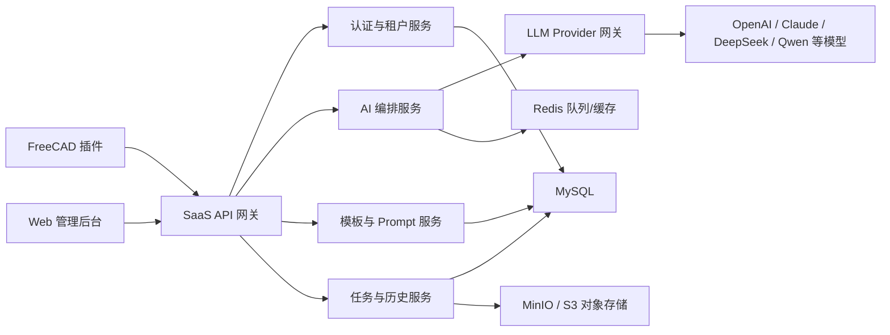

# FreeCADAI 阶段 4 SaaS 技术方案

## 1. 阶段定位

阶段 4 的目标是将当前 FreeCADAI 插件从“本地直连 LLM 的单机插件”，升级为“FreeCAD 本地客户端 + 云端 AI 编排服务”的 SaaS 雏形。

本阶段暂不建议把完整 FreeCAD 渲染能力搬到云端。更稳妥的路径是：

- FreeCAD 插件负责 UI、用户输入、当前文档上下文采集、Python 脚本执行、FreeCAD 当前视图渲染。
- 云端服务负责用户体系、LLM 调用、提示词编排、模板库、历史记录、任务审计、用量统计。
- Web 管理后台负责账号、项目、模板、历史任务、用量、配置管理。

这样可以最大化复用当前插件能力，降低云端 CAD 渲染的工程复杂度，并为后续商业化 SaaS 打基础。

## 2. 总体架构



### 核心链路

```text
用户在 FreeCAD 插件输入建模需求
  -> 插件采集当前 FreeCAD 文档上下文
  -> 插件调用 SaaS API
  -> 云端进行用户鉴权、额度校验、Prompt 编排
  -> 云端调用 LLM Provider 生成 FreeCAD Python 脚本
  -> 云端保存任务记录、脚本、token 用量
  -> 插件收到脚本
  -> 插件本地校验并执行脚本
  -> FreeCAD 当前视图渲染模型
  -> 插件回传执行结果、错误信息、对象列表
```

## 3. 技术栈选型

### 3.1 FreeCAD 插件端

| 模块 | 技术 |
| --- | --- |
| 插件语言 | Python |
| UI 框架 | PySide2 / PySide |
| CAD 执行环境 | FreeCAD Python API |
| 脚本校验 | Python AST 白名单校验 |
| 本地配置 | JSON 配置文件 |
| 本地历史 | JSONL 或 SQLite，后续可同步云端 |
| 网络请求 | Python 标准库 urllib 或 requests |

插件端继续保持轻量，不承担用户密钥管理和复杂模型编排。

### 3.2 云端后端

| 模块 | 技术 |
| --- | --- |
| 开发语言 | Python |
| API 框架 | FastAPI |
| ASGI 服务 | Uvicorn / Gunicorn |
| ORM | SQLAlchemy 2.x |
| 数据迁移 | Alembic |
| 数据库 | MySQL 8.x |
| 缓存 | Redis |
| 任务队列 | Celery + Redis |
| 对象存储 | MinIO，后续可切换阿里云 OSS / AWS S3 |
| 鉴权 | JWT + API Key |
| 日志 | structlog / loguru |
| 监控 | Prometheus + Grafana |
| 部署 | Docker Compose 起步，后续 Kubernetes |

选择 Python + FastAPI 的原因：

- 当前插件也是 Python，服务端和插件端可以共享一部分数据结构、Prompt 规则、脚本校验逻辑。
- LLM 编排、JSON Schema 校验、脚本生成、任务审计更适合 Python 快速迭代。
- FastAPI 对 OpenAPI 文档、类型校验、异步接口支持较好，适合早期 SaaS API。

### 3.3 Web 前端

| 模块 | 技术 |
| --- | --- |
| 开发语言 | TypeScript |
| Web 框架 | Next.js |
| UI 组件 | Ant Design |
| 请求状态 | TanStack Query |
| 全局状态 | Zustand |
| 图表 | ECharts |
| 3D Web 预览 | Three.js / react-three-fiber，阶段 5 之后重点建设 |

选择 Ant Design 的原因：

- 阶段 4 的 Web 端主要是管理后台，不是营销官网。
- 用户、项目、模板、任务、用量、账单等页面偏企业管理系统，Ant Design 的表格、表单、筛选、分页能力成熟。

## 4. 服务模块设计

### 4.1 认证与租户服务

负责：

- 用户注册、登录、退出。
- Workspace 团队空间。
- API Key 创建、禁用、轮换。
- 用户角色和权限。
- 插件端请求鉴权。

早期可以只实现单用户和 API Key 鉴权，但数据库结构需要预留多租户字段。

### 4.2 AI 编排服务

负责：

- 根据建模模式选择 Prompt。
- 拼接用户需求、FreeCAD 上下文、模板信息。
- 调用不同 LLM Provider。
- 解析模型返回结果。
- 校验生成脚本结构。
- 生成失败时提供修复链路。
- 记录 token、模型、耗时、错误。

云端需要统一暴露一个稳定接口，让插件不再直接依赖 OpenAI-compatible API。

### 4.3 LLM Provider 网关

负责适配不同模型供应商：

- OpenAI
- Claude
- DeepSeek
- 通义千问
- 智谱
- 私有化大模型

插件端不保存模型供应商密钥。模型密钥统一保存在云端，并按 workspace 或平台级别配置。

### 4.4 模板与 Prompt 服务

负责：

- 云端模板库管理。
- 模板分类、标签、行业场景。
- Prompt 版本管理。
- 不同模型的 Prompt 差异化配置。
- 模板灰度发布。

当前插件内置模板后续可以迁移到云端，插件启动时拉取最新模板。

### 4.5 任务与历史服务

负责：

- 生成任务记录。
- 生成脚本记录。
- 执行结果回传。
- 错误栈保存。
- 历史任务检索。
- 用户反馈和评分。
- 成本与用量统计。

任务历史是后续优化 Prompt、构建行业模板、排查生成质量问题的重要数据资产。

### 4.6 文件与资产服务

负责：

- 执行截图上传。
- STEP / STL / GLB 等模型文件保存。
- 任务附件管理。

阶段 4 可以先支持执行截图，模型文件导出可以放到阶段 5。

## 5. MySQL 数据库设计

建议使用 MySQL 8.x，字符集统一使用：

```sql
utf8mb4
```

排序规则建议：

```sql
utf8mb4_0900_ai_ci
```

### 5.1 核心表

| 表名 | 用途 |
| --- | --- |
| users | 用户账号 |
| workspaces | 团队/企业空间 |
| workspace_members | 用户与空间关系 |
| api_keys | 插件接入密钥 |
| projects | 项目 |
| llm_providers | 模型供应商配置 |
| prompt_versions | Prompt 版本 |
| templates | 云端模板库 |
| generation_tasks | 生成任务 |
| generated_scripts | 生成脚本 |
| execution_reports | 插件执行结果 |
| assets | 截图、模型文件等资产 |
| usage_records | token、调用次数、费用记录 |
| feedbacks | 用户反馈 |

### 5.2 关键字段建议

#### users

| 字段 | 说明 |
| --- | --- |
| id | 主键 |
| email | 邮箱 |
| password_hash | 密码哈希 |
| display_name | 显示名称 |
| status | active / disabled |
| created_at | 创建时间 |
| updated_at | 更新时间 |

#### workspaces

| 字段 | 说明 |
| --- | --- |
| id | 主键 |
| name | 空间名称 |
| plan | free / team / enterprise |
| status | active / suspended |
| created_at | 创建时间 |

#### api_keys

| 字段 | 说明 |
| --- | --- |
| id | 主键 |
| workspace_id | 所属空间 |
| name | API Key 名称 |
| key_hash | 密钥哈希，不保存明文 |
| prefix | 密钥前缀，用于展示和排查 |
| status | active / revoked |
| last_used_at | 最近使用时间 |
| expires_at | 过期时间 |

#### generation_tasks

| 字段 | 说明 |
| --- | --- |
| id | 主键 |
| workspace_id | 所属空间 |
| project_id | 所属项目 |
| user_id | 发起用户 |
| source | plugin / web |
| modeling_mode | 3d_solid / 2d_sketch |
| prompt | 用户原始需求 |
| context_snapshot | FreeCAD 上下文 JSON |
| template_id | 使用的模板 |
| provider | 模型供应商 |
| model | 模型名称 |
| prompt_version_id | Prompt 版本 |
| status | queued / running / succeeded / failed |
| error_message | 错误摘要 |
| latency_ms | 耗时 |
| created_at | 创建时间 |

#### generated_scripts

| 字段 | 说明 |
| --- | --- |
| id | 主键 |
| task_id | 所属任务 |
| script | FreeCAD Python 脚本 |
| summary | 生成摘要 |
| parameters_json | 参数 JSON |
| expected_objects_json | 预计对象 |
| validation_status | passed / failed |
| validation_error | 校验错误 |
| created_at | 创建时间 |

#### execution_reports

| 字段 | 说明 |
| --- | --- |
| id | 主键 |
| task_id | 所属任务 |
| script_id | 所属脚本 |
| plugin_version | 插件版本 |
| freecad_version | FreeCAD 版本 |
| os_info | 操作系统 |
| status | succeeded / failed |
| document_name | FreeCAD 文档名 |
| object_count | 对象数量 |
| new_objects_json | 新增对象 |
| error_trace | 错误栈 |
| created_at | 创建时间 |

#### usage_records

| 字段 | 说明 |
| --- | --- |
| id | 主键 |
| workspace_id | 所属空间 |
| task_id | 关联任务 |
| provider | 模型供应商 |
| model | 模型名称 |
| input_tokens | 输入 token |
| output_tokens | 输出 token |
| total_tokens | 总 token |
| estimated_cost | 预估成本 |
| created_at | 创建时间 |

## 6. API 设计

### 6.1 插件端 API

| 方法 | 路径 | 用途 |
| --- | --- | --- |
| GET | /api/v1/plugin/health | 健康检查 |
| POST | /api/v1/plugin/auth/verify | 校验插件 API Key |
| GET | /api/v1/plugin/templates | 拉取模板库 |
| POST | /api/v1/plugin/generate | 生成 FreeCAD Python 脚本 |
| POST | /api/v1/plugin/repair | 修复失败脚本 |
| POST | /api/v1/plugin/regenerate | 按参数重新生成 |
| POST | /api/v1/plugin/execution-reports | 回传执行结果 |

### 6.2 Web 管理 API

| 方法 | 路径 | 用途 |
| --- | --- | --- |
| POST | /api/v1/auth/login | 登录 |
| GET | /api/v1/me | 当前用户 |
| GET | /api/v1/workspaces | 空间列表 |
| GET | /api/v1/projects | 项目列表 |
| GET | /api/v1/tasks | 任务历史 |
| GET | /api/v1/tasks/{id} | 任务详情 |
| CRUD | /api/v1/templates | 模板管理 |
| CRUD | /api/v1/api-keys | API Key 管理 |
| GET | /api/v1/usage | 用量统计 |

## 7. 插件侧改造方案

### 7.1 新增服务模式

插件设置中增加服务模式：

```text
本地直连 LLM
云端 SaaS 服务
```

本地直连 LLM 保留，作为开发调试和离线降级能力。

云端 SaaS 服务模式下，插件配置：

- SaaS Base URL
- 插件 API Key
- 默认项目
- 是否同步历史
- 是否上传执行错误栈

### 7.2 云端生成流程

```text
插件采集 prompt + context + modeling_mode
  -> POST /api/v1/plugin/generate
  -> 云端返回 summary / parameters / script / expected_objects
  -> 插件展示脚本
  -> 插件本地执行
  -> POST /api/v1/plugin/execution-reports
```

### 7.3 模板迁移

当前模板库在插件本地：

```text
freecad_ai/templates.py
```

阶段 4 可以调整为：

- 插件保留少量内置模板，作为云端不可用时的兜底。
- 启动时优先从云端拉取模板。
- 云端模板支持分类、标签、版本、启停。

## 8. 渲染策略

### 8.1 阶段 4 推荐方案

阶段 4 推荐继续使用本地 FreeCAD 渲染：

```text
云端生成脚本
插件本地执行脚本
FreeCAD 当前视图渲染 3D/2D 结果
```

理由：

- 用户已经安装 FreeCAD，本地渲染能力成熟。
- FreeCAD Python API 在本地 GUI 环境中更稳定。
- 云端 FreeCAD Headless 渲染部署复杂，并发成本较高。
- 阶段 4 的主要价值是 SaaS 化、模板、历史、用量、Prompt 管理，不是云端 CAD 渲染。

### 8.2 后续云端预览方向

阶段 5 或阶段 6 可以新增云端预览：

```text
云端 FreeCAD Worker
  -> 执行脚本
  -> 导出 STEP / STL / GLB / PNG
  -> Web 端 Three.js 预览
```

云端预览需要额外解决：

- FreeCAD Headless 容器化。
- 字体、OpenGL、依赖库。
- Worker 沙箱隔离。
- 并发任务队列。
- 用户脚本安全隔离。
- 文件导出和清理。
- 渲染成本控制。

因此不建议放入阶段 4 主线。

## 9. 安全设计

### 9.1 插件 API Key

- API Key 只在创建时展示一次。
- 服务端只保存哈希。
- 请求头使用：

```http
Authorization: Bearer <plugin_api_key>
```

### 9.2 脚本安全

云端和插件端都需要做脚本校验：

- 禁止 os / sys / subprocess / socket 等危险模块。
- 禁止文件删除、网络访问、进程调用。
- 限制 import 白名单。
- 限制危险内置函数。

插件端仍然是最后一道防线，因为脚本最终在用户本机 FreeCAD 中执行。

### 9.3 多租户隔离

所有核心业务表都应包含：

```text
workspace_id
```

API 层所有查询都必须按 workspace 过滤，避免跨租户数据泄露。

### 9.4 敏感数据

- LLM Provider 密钥加密保存。
- API Key 只保存哈希。
- 错误栈、Prompt、上下文可能包含业务信息，需要按 workspace 隔离。
- 支持企业用户关闭数据留存或设置留存周期。

## 10. 部署架构

### 10.1 阶段 4 起步部署

推荐 Docker Compose：

```text
nginx
  -> web-nextjs
  -> api-fastapi
  -> worker-celery
  -> mysql
  -> redis
  -> minio
```

### 10.2 生产部署演进

后续可以演进到 Kubernetes：

```text
Ingress
  -> Web Deployment
  -> API Deployment
  -> Worker Deployment
  -> MySQL 托管版
  -> Redis 托管版
  -> OSS/S3 托管对象存储
```

生产环境建议优先使用云厂商托管 MySQL 和 Redis，减少运维负担。

## 11. 阶段 4 实施拆分

### 阶段 4.1：SaaS 后端骨架

- FastAPI 项目初始化。
- MySQL 连接。
- Alembic 迁移。
- 用户、Workspace、API Key 基础表。
- 健康检查接口。
- OpenAPI 文档。

### 阶段 4.2：LLM 网关

- 云端统一调用 OpenAI-compatible API。
- 预留多 Provider 适配层。
- 生成任务落库。
- token、耗时、错误记录。

### 阶段 4.3：插件接入云端

- 插件设置新增 SaaS 服务模式。
- 插件 API Key 校验。
- 生成、修复、参数重生成改为可走云端。
- 本地直连 LLM 保留为备用模式。

### 阶段 4.4：任务历史与执行回传

- 插件执行成功/失败后回传结果。
- Web 端可查看任务详情。
- 保存脚本、参数、错误栈、对象列表。

### 阶段 4.5：云端模板库

- 模板表设计与 API。
- 插件拉取云端模板。
- Web 管理后台支持模板增删改查。
- 插件保留内置模板兜底。

### 阶段 4.6：Web 管理后台

- 登录页。
- API Key 管理。
- 任务历史列表。
- 任务详情页。
- 模板管理页。
- 用量统计页。

## 12. 推荐目录结构

后续可以在仓库中新增：

```text
server/
  app/
    api/
    core/
    db/
    models/
    schemas/
    services/
    workers/
  alembic/
  tests/
  pyproject.toml

web/
  app/
  components/
  lib/
  package.json

deploy/
  docker-compose.yml
  nginx/
  mysql/
  minio/
```

插件仍保留当前目录：

```text
freecad_ai/
```

## 13. 风险与应对

| 风险 | 应对 |
| --- | --- |
| LLM 生成脚本不稳定 | 引入 Prompt 版本、模板库、失败修复链路 |
| 用户脚本执行有安全风险 | 云端和插件端双重 AST 校验 |
| 云端渲染复杂 | 阶段 4 暂不做云端渲染，继续本地 FreeCAD 渲染 |
| 多模型适配成本上升 | 先做 OpenAI-compatible，再逐步扩展 Provider |
| SaaS 多租户数据隔离 | 所有业务表预留 workspace_id |
| 任务历史数据增长快 | MySQL 分页索引，资产文件放对象存储 |
| 企业用户担心数据留存 | 支持关闭历史保存、设置保留周期、私有化部署 |

## 14. 阶段 4 结论

阶段 4 推荐采用：

```text
插件端：FreeCAD Python + PySide
后端：Python + FastAPI
数据库：MySQL 8.x
缓存/队列：Redis + Celery
对象存储：MinIO，后续兼容 S3/OSS
Web 前端：Next.js + TypeScript + Ant Design
部署：Docker Compose 起步，后续 Kubernetes
渲染：阶段 4 继续使用本地 FreeCAD 渲染
```

这套方案的重点是先把 AI 生成能力、模板能力、历史记录、用户体系和用量统计云端化。FreeCAD 仍作为本地 CAD 执行与渲染引擎，等 SaaS 主流程稳定后，再进入云端 FreeCAD Worker、Web 3D 预览、团队协同和商业计费阶段。
